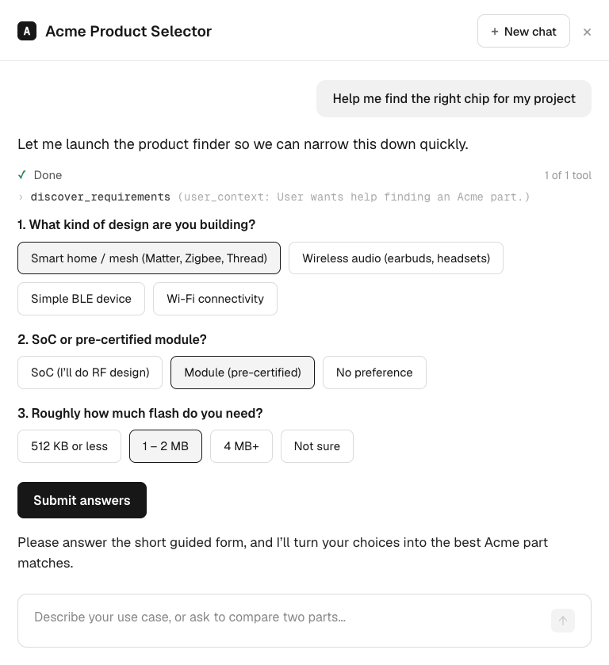
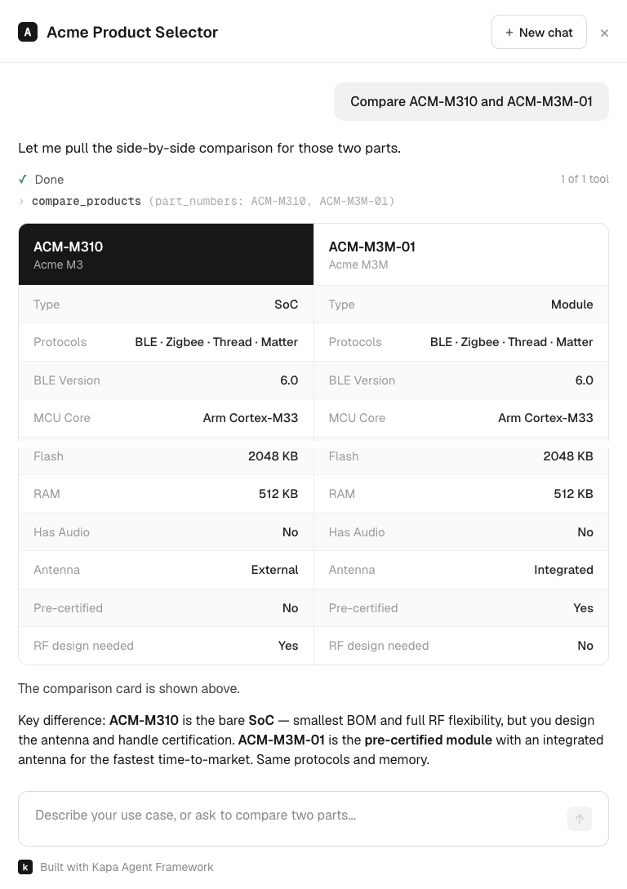
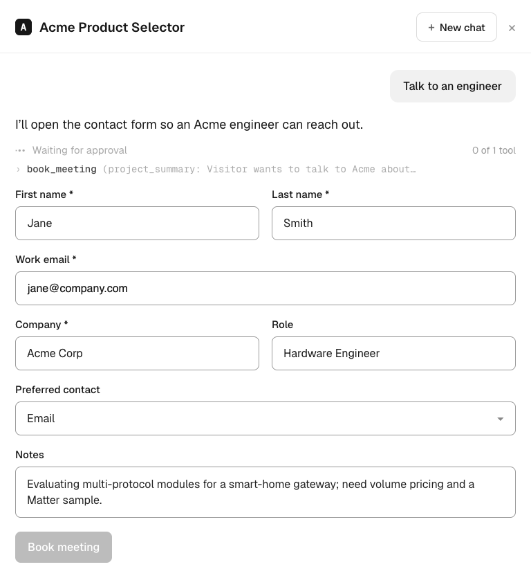

# Product Selector Starter

**An embeddable AI assistant that helps your customers find the right product by
describing what they need, in their own words instead of your filters.** It's a
working codebase, not a demo: clone it, point it at your catalogue, and ship a
chat widget that takes a visitor from "here's my problem" to "here's the product
that fits." Built on the [Kapa Agent SDK](https://docs.kapa.ai/dev/agent/).

## Why it exists

Companies with large technical catalogues lose people at the very first step. A
visitor shows up with a need in their own words — *"I'm building a
battery-powered smart-home sensor that needs to speak Matter"* — and the site
answers with spec sheets and filter tables. They don't know which filters matter
for *your* products, can't turn their use case into the right query, and leave
thinking you don't make what they need. You, meanwhile, wonder why buyers aren't
finding the products that would have been a perfect fit.

The catalogue isn't the problem. The gap is the translation between how a
customer describes their need and how your product data is organised.

## What it does

The Product Selector closes that gap. It's a conversational assistant that
understands both the visitor's intent and your catalogue, and maps everyday
language onto the filters that actually matter for your products. It searches
your real data (it never invents specs), walks the visitor to the products that
fit, and offers to book a call when they're ready.

It drops onto any site as a single `<script>` — a chat bubble that opens a
sidebar assistant. Out of the box it can:

- Search your catalogue with precise filters and return every real match
- Put two products side by side in a comparison card
- Guide unsure visitors through a few clickable questions
- Book a sales call and route the lead to your inbox, a webhook, or your CRM

## You're most of the way there when you clone it

Clone it and everything already runs: the assistant, the chat UI, the five tools, the embed, and the
lead-capture backend. What's left is configuration — pointing it at your
catalogue and tailoring the prompt, filters, and branding to your company.

To make that concrete, it ships with three example domains — wireless chips,
water pumps, and espresso machines — all running on the *same* engine. They're
starting points and inspiration, not the product itself. Pick the one closest to
your business, see how it's wired, then swap in your own data and copy. Need more
than the five built-in tools? Add your own in `src/agent/tools.tsx`.

## What's in this README

Roughly in the order you'll want it:

1. **What it is** — the problem and the solution (above).
2. **[Run it locally](#quick-start)** — a working version in three commands.
3. **[Make it yours](#make-it-yours)** — the configuration that points it at your company.
   - **[Your products](#your-products)** — connect a PIM/database (recommended) or a spreadsheet.
4. **[What it does out of the box](#what-the-agent-does-out-of-the-box)** — the five built-in tools, with room to add your own.

Reference for later: [add it to your site](#build--add-it-to-your-site) ·
[the example domains](#try-the-other-examples) · [how it works](#how-it-works) ·
[project layout](#project-layout).

## Quick start

```bash
npm install
cp .env.example .env        # add your Kapa + Resend keys
npm run dev                 # open the local playground (index.html)
```

The playground renders the widget over a deliberately ugly host page, to prove
the styling stays fully isolated (see "How it works").

The dev server is self-contained: `npm run dev` also serves the `/server`
handlers at `/api/agent-session` and `/api/book-lead` through Vite middleware, so
a real conversation works locally with no separate backend. You'll need a valid
`KAPA_API_KEY` (server-side, in `.env`) plus `PROJECT_ID` and `INTEGRATION_ID`
(read by the playground's `init()`). Without them the bubble still renders, but a
sent message stalls because the token can't be minted. The same handlers deploy
to production separately, and the secret key never enters the browser bundle.

## Make it yours

Cloning gets you the working app; this is the part you configure. Three things to
set for your company.

### Your products

All catalogue lookups (`search` / `specs` / `compare`) go through one place —
`src/catalogue/lookup.ts` — so you decide where the data lives:

- **Recommended: connect your PIM or product database.** Most companies already
  keep their catalogue in one. Wiring the selector to it gives you a single
  source of truth that's always current: price changes, new SKUs, and
  availability show up with no rebuilds. The lookup functions are the integration
  seam — back them with a call to your own `/api/catalogue` endpoint, or run the
  query directly. See the swap-in note at the top of `src/catalogue/lookup.ts`.
  Your declared `search.filters` stay the same; only the data source changes.
- **No PIM or database? Use a spreadsheet.** Drop your `.xlsx`/`.csv` in
  `catalogue/source/` and run `npm run generate:catalogue` to bake it into a
  single typed data file (this is what the examples ship with). It's the quickest
  way to get live — just re-run the generator whenever the catalogue changes.

### Branding, prompt & filters

Edit your example's `config.ts`: brand colour and logo, the welcome copy, the
system prompt (`customInstructions`), the search **filters**, guided-path
questions, the compare spec-rows, and booking. This is the main file you'll
touch; see [docs/CUSTOMIZATION.md](docs/CUSTOMIZATION.md) for every field.

### Backend

Deploy the two endpoints in [`/server`](server/README.md) — token and lead
capture — and set your env vars.

## What the agent does out of the box

Every Product Selector comes with **five tools already wired in** — no setup
required. Each one exists to answer a question the visitor is already asking, and
the assistant reaches for the right one as the conversation unfolds, rendering
its own UI in the chat. (Need more? Add your own in `src/agent/tools.tsx`.)

- **"Which products match what I need?"** When a visitor describes their
  requirements, `search_products` queries your catalogue with exact filters
  (e.g. "BLE 6.0 + Matter + ≥ 2 MB flash") and returns every match,
  deterministically. Results render as a ranked, capped list with "Show all", so
  they see the real, complete set rather than the model's paraphrase.
- **"Tell me everything about this one."** When a visitor wants to dig into a
  single product, `get_product_specs` returns its full detail — the equivalent of
  opening the data sheet, without leaving the conversation.
- **"I'm torn between these two."** `compare_products` renders a comparison card
  across the same parameters, so a visitor weighing two products that both seem to
  fit can see the real differences and decide.
- **"I don't even know where to start."** For visitors who can't yet put their
  need into words, `discover_requirements` asks a few guiding questions — what
  they're building, the requirements that matter, price sensitivity — and turns
  the answers into a targeted search.
- **"I'd like to talk to someone."** Once a visitor has the help they came for,
  `book_meeting` connects them to your Sales team with the full conversation
  attached as context, routing the lead to your inbox, a webhook, or your CRM.

The screenshots below are from the shipped **Acme** semiconductor example. (The
grey line under each reply — e.g. `discover_requirements (user_context: …)` — is
the built-in, collapsible tool-call disclosure showing exactly what the assistant
called.)

**Guided discovery** — when a visitor is unsure, the assistant launches clickable
questions and turns the answers into a search:



**Side-by-side comparison** — `compare_products` renders a visual spec card; the
assistant adds a one-line takeaway instead of re-typing the table:



**Book a call** — `book_meeting` shows the contact form immediately; the lead is
routed to your inbox, a webhook, or your CRM:



## Build & add it to your site

```bash
npm run build               # → dist/product-selector.js (single self-contained file)
```

`dist/product-selector.js` is one self-contained file. Add it to your website
like any other script: serve it alongside your existing static assets and include
the two lines below. If you already run a website, you already have everywhere
you need to put this — there's no special CDN or hosting to set up.

```html
<script src="/product-selector.js" defer></script>
<script>
  ProductSelector.init({
    projectId: "your-kapa-project-id",
    integrationId: "your-kapa-integration-id",
    sessionEndpoint: "/api/agent-session",   // your token endpoint (see /server)
    bookEndpoint: "/api/book-lead",
    accentColor: "#0D2B73",
    logo: "/logo.svg",
    title: "Product Selector",
  });
</script>
```

The only backend you need is the small token endpoint in [`/server`](server/README.md),
which keeps your Kapa API key off the browser. See
[docs/DEPLOYMENT.md](docs/DEPLOYMENT.md) for all `init()` options.

## Try the other examples

Each example is a `data.ts` (catalogue) plus a `config.ts` (branding, prompt,
filters, compare rows, booking) under `src/examples/`. Switch the active one by
editing the two imports in `src/selector.config.ts`:

```ts
export { catalogue } from "./examples/water-pumps/data";
export { config as selectorConfig } from "./examples/water-pumps/config";
```

Options: `semiconductors` · `water-pumps` · `espresso-machines`.

## How it works

```
ProductSelector.init(config)
        │
        ▼
  src/embed.tsx ──► src/mount.tsx ──► Shadow DOM root
                          │             • Emotion cache → shadow root
                          │             • Chakra cssVarsRoot=":host"
                          │             • Kapa stylesheet injected inline
                          ▼
                    src/Widget.tsx
                          │  AgentProvider (Kapa) + FAB + AgentPanel
                          ▼
                  src/agent/tools.tsx ──► precise lookups over the active
                          │               example's data.ts
                          ▼
        compare / guided-questions / booking render components
        (styled from the SDK's resolved theme — no hardcoded palette)
```

The widget mounts inside a **Shadow DOM** root, so the host page's CSS can never
touch it and vice-versa. Catalogue lookups run client-side against the single
data file: the assistant only picks filter parameters, and never invents specs.

## Project layout

```
src/
  embed.tsx            init() entry → window.ProductSelector
  mount.tsx            Shadow DOM + Emotion + Chakra + SDK CSS injection
  Widget.tsx           AgentProvider + FAB bubble + AgentPanel
  selector.config.ts   ◄── picks the active example (one-line switch)
  config/types.ts      config + runtime types
  examples/            three domains, same engine:
    semiconductors/    data.ts (catalogue) + config.ts (branding/prompt/filters)
    water-pumps/       data.ts + config.ts
    espresso-machines/ data.ts + config.ts
  catalogue/
    schema.ts          generic family/part model
    lookup.ts          precise, config-driven search / specs / compare
  agent/
    tools.tsx          the 5 example tools (extend with your own here)
    palette.ts         derives colours from the SDK's resolved theme
    components/        CompareCard · QuestionForm · BookingForm
scripts/
  generate-catalogue.ts  spreadsheet → an example's data.ts
server/
  agent-session.ts     Kapa token endpoint (required)
  book-lead.ts         booking delivery: email / webhook / HubSpot / Salesforce
docs/
  CUSTOMIZATION.md · DEPLOYMENT.md
```

Built with the [Kapa Agent SDK](https://docs.kapa.ai/dev/agent/) · Vite · Chakra UI.
